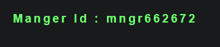

# SCRUM-4: Manager ID displayed as 'Manger Id'

**Severity:** Low  
**Status:** Open  
**Environment:** demo.guru99.com/V4 — Chrome Browser, Windows 10  

## Steps to Reproduce
1. Open demo.guru99.com/V4 in a browser
2. Click the "here" button to create a new account
3. Insert Email ID
4. Press Submit
5. Copy the credentials
6. Press Back twice to return to the login screen
7. Log into the newly created account

## Actual Result
After logging in, the Manager ID label is displayed 
incorrectly as **'Manger Id'** instead of 'Manager ID'.

## Expected Result
After logging in, the Manager ID label should be 
correctly displayed as **'Manager ID'**.

## Screenshot

