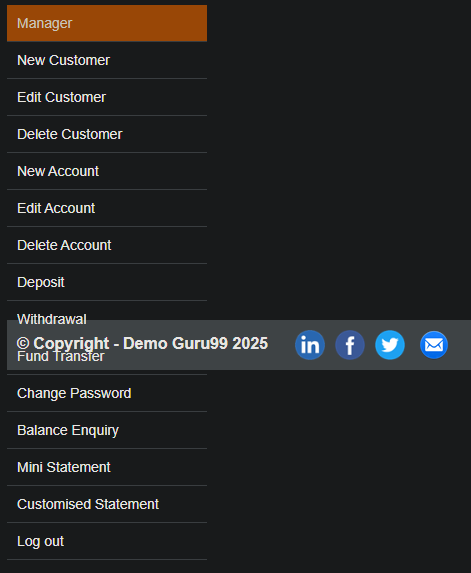

# SCRUM-5: Copyright bar overlapping Manager Taskbar

**Severity:** High  
**Status:** Open  
**Environment:** demo.guru99.com/V4 — Chrome Browser, Windows 10  

## Steps to Reproduce
1. Open demo.guru99.com/V4 in a browser
2. Log in to the Manager account
3. Try to select the "Fund Transfer" option from the Manager Taskbar
4. Select any other option from the Manager Taskbar
5. Observe that the Copyright bar overlaps the taskbar again

## Actual Result
The "Fund Transfer" option is not available to click because 
the Copyright bar overlaps the Manager Taskbar. The issue 
persists every time a different option is selected.

## Expected Result
The Copyright bar should be displayed underneath the Manager 
Taskbar in order not to interfere with its options.

## Workaround
None — the Copyright bar returns to overlap the Manager 
Taskbar every time a different option is selected.

## Screenshot

