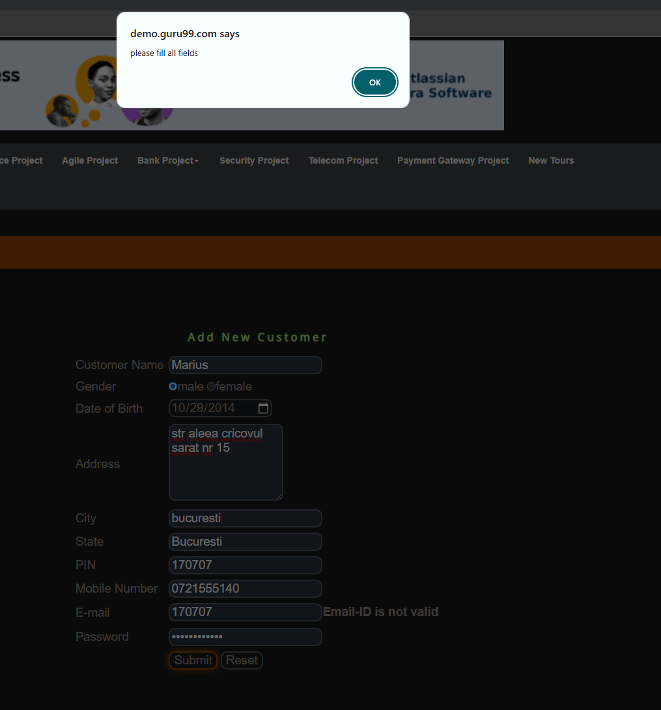

# SCRUM-6: "Please fill all fields" alert shown incorrectly when email format is invalid

**Severity:** Medium  
**Status:** Open  
**Environment:** demo.guru99.com/V4 — Chrome Browser, Windows 10  

## Steps to Reproduce
1. Open demo.guru99.com/V4 in a browser
2. Click the "here" button to create a new account
3. Fill in all required fields
4. Enter an incorrectly formatted email address (e.g. "testgmail.com")
5. Press Submit

## Actual Result
The system displays a generic "Please fill all fields" 
alert, even though all fields are filled in. The alert 
is misleading and does not indicate the actual issue.

## Expected Result
The system should display a specific validation message 
such as "Please enter a valid email address" to clearly 
inform the user of the formatting error.

## Screenshot

