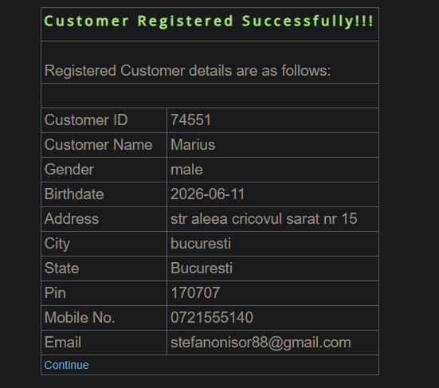

# SCRUM-7: System allows customer registration with an email already registered as a manager account

**Severity:** Critical
**Status:** Open  
**Environment:** demo.guru99.com/V4 — Chrome Browser, Windows 10  

## Steps to Reproduce
1. Open demo.guru99.com/V4 in a browser
2. Log in to the Manager account
3. Navigate to New Customer
4. Fill in all required fields using the Manager account email address
5. Press Submit

## Actual Result
The system successfully creates a new customer account 
using an email address that is already registered as a 
Manager account, allowing duplicate email registration 
across different account types.

## Expected Result
The system should prevent registration with an email 
address already in use and display an appropriate error 
message such as "This email is already registered."

## Screenshot

